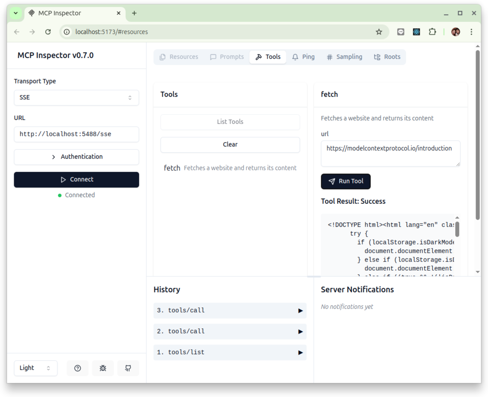

# mcp-simple-tool

一個簡單的 MCP 伺服器，用來取得公開網站內容的工具。

本程式的原始版本: [modelcontextprotocol/examples/servers/simple-tool](https://github.com/modelcontextprotocol/python-sdk/tree/main/examples/servers/simple-tool)

## 環境準備

本範例 MCP MCP 伺服器使用 [uv](https://docs.astral.sh/uv/) 來做 Python 套件和專案管理器。請依據 uv 官網的訊息來進行安裝與設定。

使用下列命令來完成運行環境準備：

```bash
$ git clone https://github.com/erhwenkuo/mcp-simple-tool.git

$ cd mcp-simple-tool

$ uv sync
```

## 啟動 MCP Server

使用 SSE transport 來啟動 MCP Sever:

```bash
# Using SSE transport on custom port
$ uv run mcp_simple_tool --transport sse --port 5488
```

這個 MCP 服務公開了一個名為 **fetch** 的工具，該工具接受一個必要參數：
- `url`: The URL of the website to fetch data from

## 使用 MCP Client 來驗證

使用 MCP 用戶端并使用 SSE 傳輸協定來遠端連結到這個 MCP Sever 來使用該工具：

```python
import asyncio
from mcp.client.session import ClientSession
from mcp.client.sse import sse_client


async def main():
    async with sse_client(url="http://localhost:5488/sse") as (read, write):
        async with ClientSession(read, write) as session:
            await session.initialize()

            # List available tools
            tools = await session.list_tools()
            print(tools)

            # Call the fetch tool
            result = await session.call_tool("fetch", {"url": "https://modelcontextprotocol.io/introduction"})
            print(result)


if __name__ == "__main__":
    asyncio.run(main())
```

## 使用 MCP Inspector 來驗證

MCP Inspector 是用於測試和調試 MCP Server 的開發人員工具。在一台安裝好 [Node.js](https://nodejs.org/) 的電腦上執行下列命令:

```bash
$ npx @modelcontextprotocol/inspector

Starting MCP inspector...
Proxy server listening on port 3000

🔍 MCP Inspector is up and running at http://localhost:5173 🚀
```



## 程式的運作流程

1. 列出工具
   - 當 MCP Client 詢問 /list_tools 端點時，伺服器會回傳 fetch 工具的資訊。

2. 客戶端請求抓取網站
   - MCP Client 發送 `fetch` 工具請求，並提供 {"url": "https://example.com"}。
   - 伺服器驗證 `url` 是否存在。
   - 伺服器透過 `fetch_website(url)` 抓取網頁內容。

3. 回傳網頁內容
   - MCP 伺服器將 TextContent 格式的網頁 HTML 回傳給 Client。